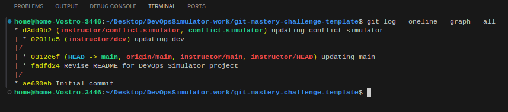
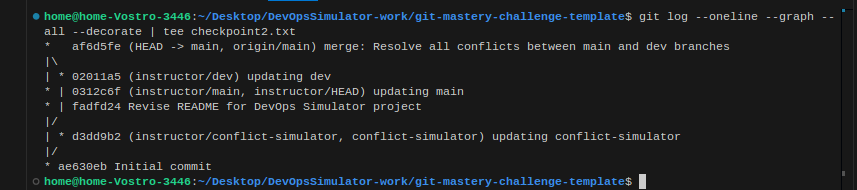
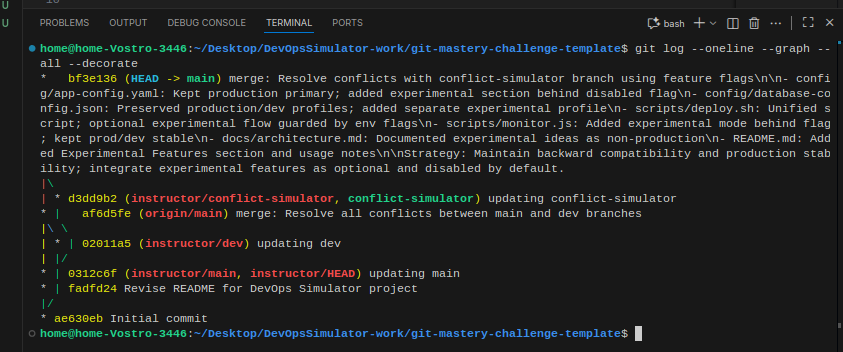

# DevOps Simulator

A comprehensive CI/CD configuration management tool for enterprise deployments.

## Project Status
- **Version**: 1.0.0 (Production), 2.0.0-beta (Development)
- **Environments**: Production & Development
- **Student**: CHITTURI DOLA SATYA SIVA SHANKAR BABA
- **Student ID**: 23A91A05E9

## Features

### Core Features
- Automated deployment scripts
- Real-time monitoring
- Configuration management
- Backup and recovery system

### Production Features
- SSL/TLS encryption
- Auto-scaling
- Load balancer integration
- Scheduled backups

### Development Features (Beta)
- Docker Compose integration
- Hot reload enabled
- Debug mode active
- Enhanced logging
- Mock external APIs

### Experimental Features (Disabled by default)
The conflict-simulator branch introduces AI/ML and multi-cloud ideas. These are behind feature flags and NOT production-ready:
- AI-powered deployment optimization (flag: AI_OPTIMIZATION)
- Predictive scaling and anomaly detection
- Multi-cloud orchestration concepts
- Chaos engineering experiments

## Quick Start

### Production Mode
```bash
export DEPLOY_ENV=production
./scripts/deploy.sh
```

### Development Mode
```bash
export NODE_ENV=development
npm install
npm run dev
```

### Experimental Mode (for exploration only)
```bash
export DEPLOY_ENV=experimental
# Optional feature flags
export AI_OPTIMIZATION=false
export CHAOS_TESTING=false
./scripts/deploy.sh
```

## Documentation
See `/docs` folder for detailed documentation. Experimental notes are summarized in `docs/architecture.md` and are disabled by default.

## Checkpoints
Place your screenshots under `docs/images/` and they will render below.





## License
MIT License
 
